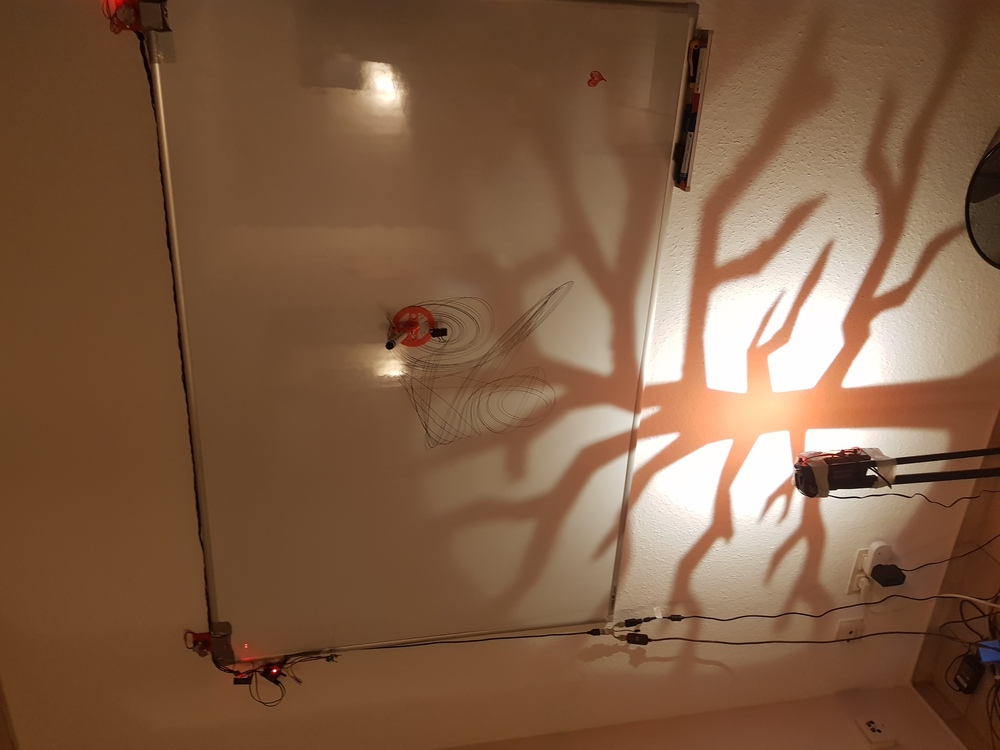
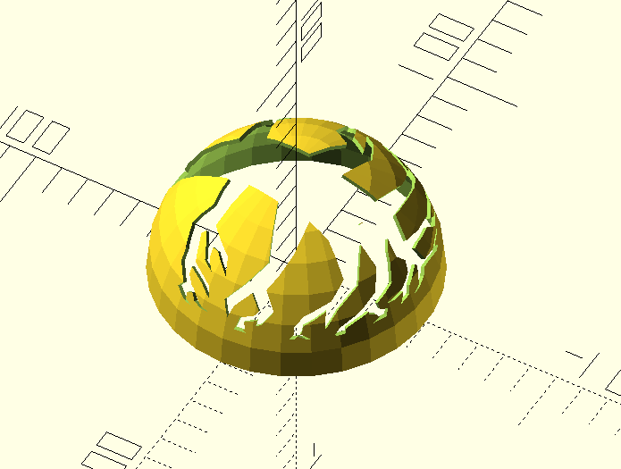
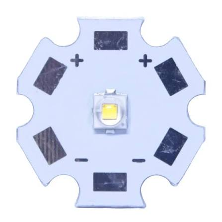

# Branch Pattern Projector Lamp

A 3D-printed lampshade that projects a pattern onto a wall.

The idea is simple: put a bright point-like light source in the center of a hollow spherical dome. A pattern is cut into the dome so that the light passing through it projects a recognizable silhouette onto the surrounding wall.

The geometry is generated from an SVG file using [OpenSCAD](https://openscad.org/).




## How it works

The dome is modeled as a thin hemispherical shell. The SVG pattern is interpreted as a set of rays originating from the center of the dome.

These rays are extended until they intersect the spherical shell. The resulting geometry is then either **subtracted from** or **intersected with** the dome.

This produces two complementary variants:

* `image_dome()` — cuts the projected SVG pattern **out of** the dome.
* `n_image_dome()` — keeps the material corresponding to the projected SVG pattern, producing the **inverse** pattern.

The following OpenSCAD screenshots illustrate the two approaches:

### `image_dome()`



### `n_image_dome()`


The SVG is effectively extruded into a cone-shaped volume before it is applied to the spherical shell:


Because the geometry is generated from the center of the dome, the pattern is projected naturally onto the wall when the light source is placed approximately at that same point.

## Creating your own pattern

The easiest way to make a new lamp is to replace `branch_dome.svg` with your own SVG artwork.

The SVG should contain a silhouette or other simple, closed graphic. Black-and-white artwork works particularly well.

1. Create or select an SVG pattern.
2. Replace `branch_dome.svg` with your SVG file.
3. Adjust `image_scale` in `branch_dome.scad` if necessary.
4. Choose either `image_dome()` or `n_image_dome()`.
5. Render the model in OpenSCAD.
6. Export the resulting STL and print it.

The SVG is imported directly by OpenSCAD, so no separate conversion step is required.

## OpenSCAD parameters

The main dimensions are defined near the beginning of `branch_dome.scad`:

```scad
dome_radius = 50;
dome_thickness = 1.5;
image_scale = 5;
```

### `dome_radius`

Radius of the spherical dome in millimeters.

The default is **50 mm**, giving a dome approximately 100 mm in diameter.

### `dome_thickness`

Wall thickness of the printed dome.

The default is **1.5 mm**.

### `image_scale`

Scaling factor used when importing the SVG.

The default value is **5**. Depending on the dimensions of your SVG artwork, this may need to be adjusted to obtain the desired pattern size.

## The base

The script also contains a `dome_base()` module that creates a short solid section at the bottom of the dome:

```scad
dome_base(15);
```

The default height is **15 mm**.

This provides a convenient place to mount or support the dome and to position the LED approximately at the center of the spherical geometry.

## Choosing the pattern orientation

At the end of the OpenSCAD file, the modules can be enabled or disabled to select what is rendered:

```scad
//image_dome();
//dome_base(15);
n_image_dome();
```

For example, to create the cut-out version, use:

```scad
dome_base(15);
image_dome();
```

For the inverse version:

```scad
dome_base(15);
n_image_dome();
```

The repository also contains pre-generated STL and SVG files for the example design.

## Light source

The lamp is designed around a small, bright LED positioned approximately at the center of the dome.

The example uses a **3 W LED chip (XPE/XPE2 type) mounted on an aluminum heatsink**.



A 3 W LED produces considerably more heat than a typical indicator LED. It therefore needs an appropriate heatsink and a suitable constant-current driver. Do not operate a high-power LED without adequate thermal management.

The brighter and more point-like the light source, the sharper and more clearly defined the projected pattern will be.

## Printing

The dome is intentionally thin and can be printed as a single part.

The optimal print settings depend on the printer and material, but the default **1.5 mm wall thickness** should make the model reasonably straightforward to print.

The pattern itself can contain fairly fine features, so the printer's XY resolution and the chosen SVG artwork will affect the final result.

## Files

* `branch_dome.scad` — OpenSCAD source
* `branch_dome.svg` — source artwork used for the example
* `stl/branch_dome.stl` — example printable model
* `stl/n_image_dome.stl` — example printable model


## Have fun with it!

The interesting part of this project is that the SVG does not have to be a tree.

Try logos, geometric patterns, silhouettes, text, or your own artwork. The OpenSCAD code does the geometrical projection automatically.
