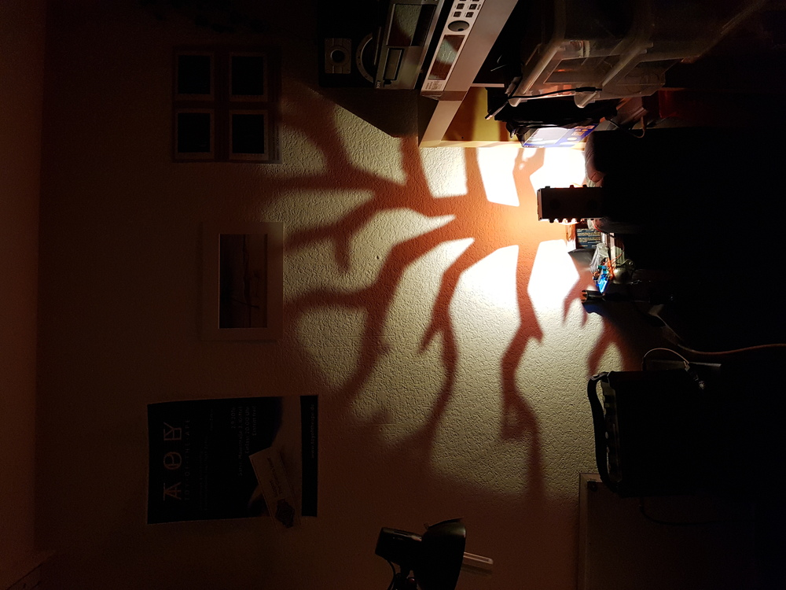
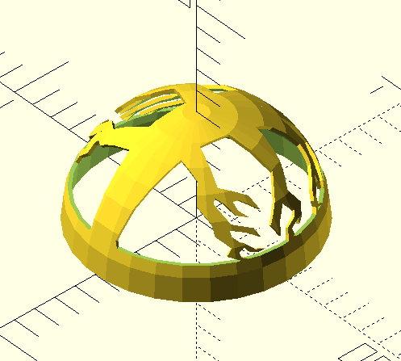
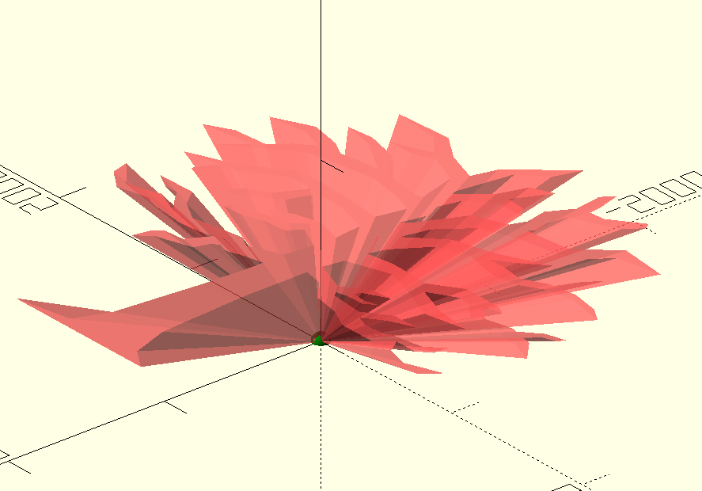

# branch pattern projector lamp

- 3d printed dome
- an SVG silhouette can be cut into (or out of) the dome
- a bright LED is put at the center of the dome
- the "lampshade" projects this silhouette onto a wall
- the subtraction is coded in OpenSCAD (see .scad script)
- try it with your own SVG graphics

# examples

- examples of a lamp made with the n_image_dome() function

# screenshots from OpenSCAD

- image_dome() function

- n_image_dome() function (the inverse)

- the SVG image is extruded into a cone shape and then subtracted from the dome

# LED light

- the light is a 3W LED chip light on an aluminum heat sink (Type XPE/XPE2) from AliExpress

